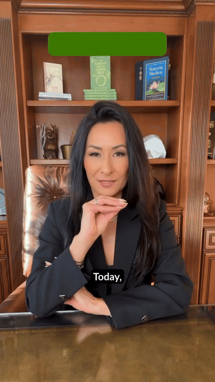
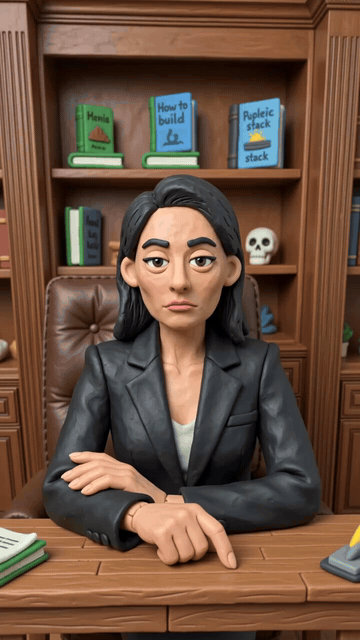

```
   _____                   _____            .__
  /     \ _____  ___  ____/ ____\_ __  _____|__| ____   ____
 /  \ /  \\__  \ \  \/  /\   __\  |  \/  ___/  |/  _ \ /    \
/    Y    \/ __ \_>    <  |  | |  |  /\___ \|  (  <_> )   |  \
\____|__  (____  /__/\_ \ |__| |____//____  >__|\____/|___|  /
        \/     \/      \/                 \/               \/
```

# Ad Restyler

A [Claude](https://claude.com) skill that restyles any ad or video into a completely different visual world — Aardman claymation, LEGO-style bricks, X-ray, 16-bit pixel art, Ghibli anime, felt puppets, voxel art, knitted yarn, premium Pixar-style 3D — while keeping every shot, camera move, performance, and beat of motion **exactly as filmed**.

You give it a video and pick a style. The skill walks a fixed gate flow — source check, style selection, preservation preferences, prompt approval — then either generates the restyled clips itself through the MaxFusion MCP (Google Omni Flash, video-to-video) and returns them in chat, or hands you the complete run-ready prompt package for your own Google AI Studio key. Either way you end the conversation with everything you need.

## Examples

| Original | Restyled |
| --- | --- |
|  |  |
| *source ad* | *Aardman Claymation* |
|  |  |
| *source ad* | *Felt Puppet Stop-Motion* |
|  |  |
| *source ad* | *Plastic Construction Bricks (LEGO-style)* |

Full-quality MP4s are in [`examples/`](examples/).

## What the skill enforces

- **The Core Formula** — every restyle prompt follows one locked skeleton: style name, material and rendering details, and a mandatory verbatim invariance clause ("Keep everything else exactly the same — same shots, same camera moves, same motion."). That clause is what makes this a restyle instead of a regeneration.
- **A five-gate flow** — source check, style selection, preservation preferences, prompt approval, delivery choice. Nothing generates before you approve the exact prompt.
- **Materials only, never content** — style details describe surfaces, textures, and rendering. No new actions, characters, objects, settings, or text ever enter a prompt.
- **Performance preservation** — when the source has people whose facial performance and comic timing matter, a dedicated preservation line is appended so the acting survives the restyle.
- **Segment consistency** — ads longer than 10 seconds are split into segments, and every segment runs the **identical** prompt. Consistency comes from prompt identity; the style wording never varies between clips.
- **One style per prompt** — never blended, unless you explicitly ask for a hybrid custom style.
- **A 9-preset library + custom style builder** — styles not in the library are built live through the same Core Formula and shown to you before anything runs.
- **MCP discipline** — on the MaxFusion path: live capability check before generating, 720p locked, clips delivered as inline widgets in chat.

## Requirements

- **[Claude Code](https://claude.com/claude-code)** (or any agent that can follow the skill file).
- **[MaxFusion](https://maxfusion.ai) MCP** — video generation runs through it on the default path.

## Install

1. Drop `SKILL.md` into your skills directory:

```
mkdir -p ~/.claude/skills/ad-restyler
curl -o ~/.claude/skills/ad-restyler/SKILL.md \
  https://raw.githubusercontent.com/holy-templar/ad-restyler/main/SKILL.md
```

2. Connect the MaxFusion MCP server:

```
claude mcp add --transport http maxfusion https://mcp.maxfusion.ai/mcp
```

   The first call will ask you to authenticate with your MaxFusion account.

3. In Claude Code, say something like:

> *restyle this ad as claymation* — and attach your video.

The skill takes it from there: style menu, preservation preferences, prompt approval, then generation.

## Using it without MaxFusion

The skill file is written for the MaxFusion MCP tool surface, but the pipeline is portable. At the delivery gate, answer **no** to MaxFusion generation and you'll need:

- a **Google AI Studio API key** — for the Google Omni Flash video-to-video model that performs the restyle.

If your agent can execute against that API, it runs the generation for you. If not, the skill delivers the complete run-ready package in chat — the final prompt per segment plus run instructions: upload your clip (≤10s), paste the prompt, generate at the highest available resolution. Prompts, gates, and rules stay exactly the same.

## License

[MIT](LICENSE)
